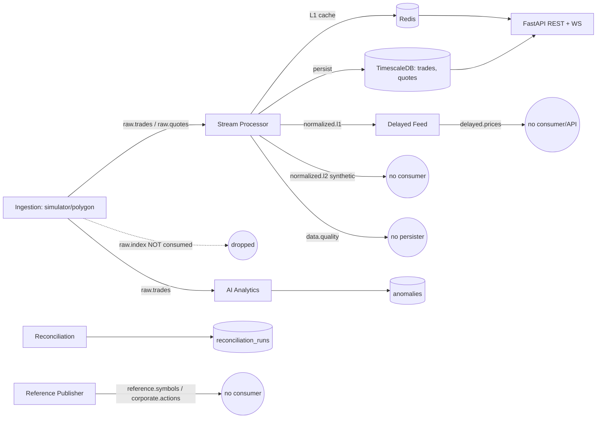
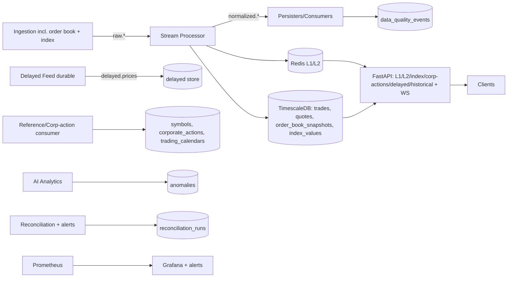
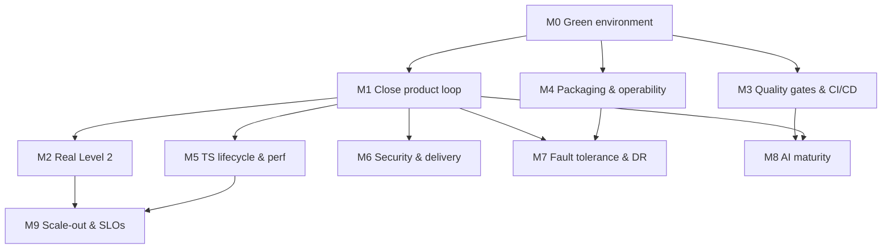

# Market Data Services — Implementation Plan, Status & Flow

> Living document tracking what the platform sets out to deliver, what is already
> built, what is pending, and the sequenced plan to close the gaps.
>
> Scope is derived from the founding vision: collect, process, enrich, and
> distribute financial market data (real-time, delayed, historical, tick, L1, L2,
> index, corporate actions, reference data) with a data/AI-engineering focus on
> high-throughput streaming, low-latency messaging, data quality/reconciliation,
> fault tolerance/DR, distributed systems, time-series storage, APIs, and
> AI-driven analytics.

---

## 1. Executive summary

The **core real-time pipeline is functional in code**: simulated (or Polygon)
ingestion → Redpanda → stream processing → TimescaleDB + Redis → REST/WebSocket
API, with Prometheus/Grafana observability, a z-score anomaly detector, and a
reconciliation job. This proves out high-throughput streaming, low-latency
delivery, time-series storage, API development, and a first AI analytics loop.

The **product surface is partially wired**: several product feeds (Level 2, index,
corporate actions, delayed feed, full reference data) are modelled in schemas and
topics but are **not persisted or exposed end-to-end**. The **engineering
hardening** dimensions (tests, CI/CD, containerized services, fault tolerance/DR,
retention policies, security) are largely **pending**.

Overall maturity: **strong walking-skeleton / MVP of the real-time path; not yet
feature-complete or production-hardened.**

---

## 2. Accomplishment matrix

### 2.1 Product feeds

| Product | Target | Status | Evidence / Gap |
|---|---|---|---|
| Real-time feed | Live prices, trades, quotes | **Done (MVP)** | `ingestion` → `raw.*` → `stream_processor` → Redis + `normalized.l1/l2` → API WebSocket `/ws/v1/stream/{symbol}` |
| Tick data | Every individual event | **Done (MVP)** | `trades`/`quotes` hypertables written per tick; REST `/v1/trades`, `/v1/quotes` |
| Level 1 | Best bid/ask/last | **Done (MVP)** | Redis `l1:{symbol}` + `normalized.l1` + REST `/v1/l1/{symbol}` |
| Historical DB | Years of trades/quotes | **Partial** | Trades/quotes persisted; no retention/compression; index/L2/corp-actions history missing |
| Delayed feed | 15–20 min delay | **Partial** | `delayed_feed` buffers in-memory → `delayed.prices`; **no persistence, no consumer, no API**; lost on restart |
| Level 2 | Full order book / depth | **Partial (synthetic)** | Only top-of-book synthesized to `normalized.l2`; `order_book_snapshots` never written; `raw.orderbook` unused; no API |
| Index feed | Live index values | **Partial** | Simulator emits `raw.index`; **not consumed**; `index_values` never populated; no API |
| Corporate actions | Dividends/splits/mergers | **Partial** | Published to `corporate.actions`; **never persisted**; `corporate_actions` table unused; no API |
| Reference data | IDs, calendars, symbol maps | **Partial** | `symbols` seeded via `init.sql`; REST `/v1/symbols` works; `reference.symbols` topic unconsumed; `trading_calendars` empty |

### 2.2 Engineering focus areas

| Focus area | Status | Evidence / Gap |
|---|---|---|
| High-throughput stream processing | **Done (MVP)** | Redpanda + consumer groups per service; fixed 3 partitions; no per-asset-class partitioning/scaling strategy yet |
| Low-latency messaging | **Done (MVP)** | Redis pub/sub → WebSocket fan-out; L1 hot-path cache |
| Data quality & reconciliation | **Partial** | Price-spike detection + `reconciliation` job + `reconciliation_runs`; `data.quality` topic **not persisted** to `data_quality_events`; no alerting |
| Time-series databases | **Partial** | TimescaleDB hypertables + indexes; **no compression/retention/continuous aggregates** |
| API development | **Done (MVP)** | FastAPI REST + WebSocket, API-key auth, `/health`, `/metrics`; missing L2/index/corp-action/delayed endpoints; single static key; no per-client auth tiers |
| AI-driven analytics & anomaly detection | **Done (MVP)** | Rolling z-score detector → `anomalies` + topic; single model, no serving/backtesting/feature store |
| Distributed systems | **Partial** | Independent services/consumer groups; no orchestration, service discovery, or partition strategy |
| Fault tolerance & DR | **Pending** | Only container healthchecks + Kafka retention; no replication, backups, replay tooling, or multi-AZ |
| Observability | **Done (MVP)** | Prometheus scrape + Grafana dashboard/provisioning; no alerts/log aggregation/tracing |

### 2.3 Delivery engineering (cross-cutting)

| Item | Status | Notes |
|---|---|---|
| Local infra (compose) | **Done** | Redpanda, Redis, TimescaleDB, Console, Prometheus, Grafana |
| Service packaging | **Pending** | Services run on host; `start_services.bat` is **Windows-only**; no Dockerfiles; no Linux/macOS run script |
| Automated tests | **Pending** | `pytest` configured in `pyproject.toml` but **no `tests/`** |
| CI/CD | **Pending** | No `.github/workflows`; lint (`ruff`)/type (`mypy`) not enforced |
| Config/secrets | **Partial** | `.env.example` present; secrets management/rotation not addressed |
| Security | **Pending** | Single static API key; no TLS, rate limiting, authz tiers, or audit |

---

## 3. System flow

### 3.1 Current (as-built) data flow

### 3.2 Target (feature-complete) data flow

---

## 4. Gap backlog (prioritized)

Priority: **P0** = correctness/blockers to run, **P1** = complete promised product
surface, **P2** = hardening/scale, **P3** = advanced/AI/DR.

- **P0 — Runnable & verified environment**: install/verify Docker stack, create
  topics, run all services on Linux (add `scripts/start_services.sh`), execute the
  README "hello world" (publish → query REST → observe WebSocket).
- **P0 — Smoke test**: one end-to-end automated test proving tick → DB → API.
- **P1 — Persist orphaned streams**: consumers for `normalized.l2` →
  `order_book_snapshots`, `raw.index` → `index_values`, `corporate.actions` →
  `corporate_actions`, `reference.symbols` → `symbols` upsert, `data.quality` →
  `data_quality_events`, `delayed.prices` → durable store.
- **P1 — Complete API surface**: `/v1/l2/{symbol}`, `/v1/index/{symbol}`,
  `/v1/corporate-actions/{symbol}`, `/v1/delayed/{symbol}`, historical index.
- **P1 — Real Level 2 ingestion**: model + produce full depth to `raw.orderbook`
  and process it (simulator depth generator first, vendor depth later).
- **P1 — Trading calendars**: seed/publish + `/v1/calendar` endpoint.
- **P2 — Test suite + CI**: unit tests for schemas/topics/validators, integration
  tests against ephemeral compose; GitHub Actions running `ruff`, `mypy`, `pytest`.
- **P2 — Containerize services**: per-service Dockerfiles + compose profiles so the
  whole platform runs with one command.
- **P2 — Time-series lifecycle**: compression, retention, continuous aggregates
  (e.g., OHLCV rollups) for historical queries.
- **P2 — Security**: per-client API keys/JWT, rate limiting, TLS, audit logging.
- **P3 — Fault tolerance/DR**: durable delayed-feed state, consumer offset/DLQ
  strategy, backup/restore, replay tooling, multi-broker replication.
- **P3 — AI maturity**: model registry/serving, backtesting, additional detectors
  (isolation forest, LSTM/AE), feature store, drift monitoring, alert routing.
- **P3 — Scale**: per-asset-class partitioning, horizontal consumer scaling,
  load/latency benchmarking with SLOs.

---

## 5. Sequenced roadmap (milestones, no calendar estimates)

Ordering reflects dependencies and risk, not calendar time. Sizing is relative
complexity: **S** small, **M** medium, **L** large.

### Milestone 0 — Green environment (P0)
- **Goal:** anyone can bring the stack up and run the README hello-world on Linux.
- **Tasks:** install Docker; `docker compose up -d`; `create_topics.py`; add
  `scripts/start_services.sh`; run services; verify REST + WebSocket. *(M)*
- **Done when:** a trade flows simulator → TimescaleDB → `/v1/trades` and a live
  tick appears on the WebSocket; a smoke test asserts it. *(depends on: nothing)*

### Milestone 1 — Close the product loop (P1)
- **Goal:** every promised feed is persisted and queryable.
- **Tasks:** add persister consumers (L2, index, corp-actions, reference,
  data-quality, delayed); extend stream processor to handle `raw.index` and
  `raw.orderbook`; add missing REST endpoints; seed trading calendars. *(L)*
- **Done when:** each product in §2.1 has a working ingest → store → API path.
  *(depends on: M0)*

### Milestone 2 — Real Level 2 & enrichment (P1)
- **Goal:** genuine order-book depth, not synthetic top-of-book.
- **Tasks:** depth schema + simulator depth generator; L2 processing to
  `order_book_snapshots`; L2 cache + API; corporate-action price adjustment
  enrichment. *(L)* *(depends on: M1)*

### Milestone 3 — Quality gates & CI/CD (P2)
- **Goal:** changes are automatically linted, typed, and tested.
- **Tasks:** `tests/` (unit + integration on ephemeral compose); GitHub Actions
  (`ruff`, `mypy`, `pytest`); coverage gate; pre-commit. *(M)* *(depends on: M0)*

### Milestone 4 — Packaging & operability (P2)
- **Goal:** one-command full-platform run; production-shaped config.
- **Tasks:** per-service Dockerfiles + compose profiles; structured logging;
  Grafana alert rules; health/readiness endpoints per service. *(M)*
  *(depends on: M0)*

### Milestone 5 — Time-series lifecycle & performance (P2)
- **Goal:** efficient historical storage and fast historical queries.
- **Tasks:** compression + retention policies; continuous aggregates (OHLCV);
  query benchmarks; partition/index tuning. *(M)* *(depends on: M1)*

### Milestone 6 — Security & multi-tenant delivery (P2/P3)
- **Goal:** safe external distribution.
- **Tasks:** per-client keys/JWT, entitlements per feed/tier, rate limiting, TLS,
  audit logging. *(M)* *(depends on: M1)*

### Milestone 7 — Fault tolerance & DR (P3)
- **Goal:** survive process/broker/DB failure without data loss.
- **Tasks:** durable delayed-feed state; DLQ + offset/retry strategy;
  backup/restore + replay from Kafka offsets; broker replication. *(L)*
  *(depends on: M1, M4)*

### Milestone 8 — AI maturity (P3)
- **Goal:** beyond a single z-score model.
- **Tasks:** model registry/serving; backtesting harness; additional detectors;
  feature store; drift monitoring; alert routing. *(L)* *(depends on: M1, M3)*

### Milestone 9 — Scale-out & SLOs (P3)
- **Goal:** demonstrate horizontal scale and defined latency/throughput SLOs.
- **Tasks:** per-asset-class partitioning; multi-instance consumers; load tests;
  publish SLOs + dashboards. *(L)* *(depends on: M2, M5)*

---

## 6. Dependency flow of milestones

---

## 7. Definition of done for "v1.0"

- All nine product feeds in §2.1 are **persisted and queryable** via API.
- **Real Level 2** depth (not synthetic) is ingested, stored, and served.
- **CI enforces** lint + types + tests; smoke + integration tests are green.
- Whole platform runs via **one command** (containerized services + infra).
- TimescaleDB has **retention/compression + OHLCV aggregates**.
- API supports **per-client auth + entitlements + rate limiting** over TLS.
- **DR runbook** exists: backup/restore + Kafka replay verified.
- Grafana has **alerting**; reconciliation and data-quality events are persisted
  and surfaced.
