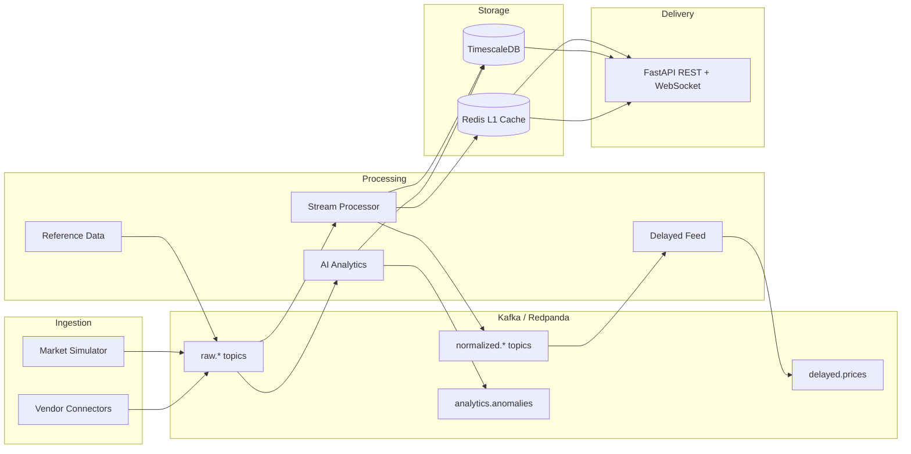

# Market Data Services — Architecture

## Overview

MDS is a distributed platform for collecting, processing, enriching, and distributing financial market data. It targets the product surface area of commercial market data vendors: real-time feeds, delayed feeds, historical storage, tick/L1/L2 data, index feeds, corporate actions, and reference data.

## System Diagram



## Product Mapping

| Product | Implementation |
|---------|----------------|
| Real-time feed | Kafka `normalized.l1/l2` + Redis cache + WebSocket `/ws/v1/stream/{symbol}` |
| Delayed feed (15–20 min) | `services/delayed_feed` buffers L1 snapshots |
| Historical database | TimescaleDB hypertables: `trades`, `quotes`, `order_book_snapshots` |
| Tick data | Raw `trades` / `quotes` with microsecond timestamps |
| Level 1 | Redis `l1:{symbol}` + `normalized.l1` topic |
| Level 2 | `order_book_snapshots` table + `normalized.l2` topic |
| Index feed | `index_values` hypertable + `raw.index` topic |
| Corporate actions | `corporate_actions` table + `corporate.actions` topic |
| Reference data | `symbols`, `trading_calendars` + `reference.symbols` topic |

## Engineering Focus Areas

### High-throughput stream processing
- Kafka (Redpanda) as the event backbone with partitioned topics per asset class
- Stateless stream processors that scale horizontally via consumer groups

### Low-latency messaging
- Redis pub/sub for sub-millisecond fan-out to WebSocket clients
- L1 cache in Redis for REST hot-path reads

### Data quality and reconciliation
- Price spike detection in stream processor → `data.quality` topic
- `data_quality_events` audit table for downstream reconciliation jobs

### Fault tolerance and disaster recovery
- Kafka retention + TimescaleDB as durable store (replay from offset on failure)
- Docker Compose for local DR testing; production path: multi-AZ Kafka, read replicas

### Distributed systems
- Each service is an independent process with its own consumer group
- Shared schemas in `libs/mds_common` for contract consistency

### Time-series databases
- TimescaleDB hypertables with time-based partitioning and symbol indexes
- Compression and retention policies (add in production)

### API development
- FastAPI with API key auth, REST for historical/reference, WebSocket for real-time

### AI-driven analytics
- Rolling z-score anomaly detector (`services/ai_analytics`)
- Extensible to isolation forests, LSTM autoencoders, or LLM-based event summarization

## Service Topology

```
services/
├── ingestion/          # Vendor connectors + market simulator
├── stream_processor/   # Normalize, validate, persist, cache
├── delayed_feed/       # 15-minute delayed price release
├── reference_data/     # Symbol mappings, corporate actions
├── ai_analytics/       # Anomaly detection
└── api/                # REST + WebSocket gateway
```

## Kafka Topics

| Topic | Purpose |
|-------|---------|
| `raw.trades` | Inbound trade ticks |
| `raw.quotes` | Inbound quote ticks |
| `raw.orderbook` | Full depth snapshots |
| `raw.index` | Index value updates |
| `normalized.l1` | Best bid/ask/last |
| `normalized.l2` | Order book depth |
| `delayed.prices` | Time-delayed L1 prices |
| `corporate.actions` | Dividends, splits, mergers |
| `reference.symbols` | Identifier mappings |
| `data.quality` | Validation warnings/errors |
| `analytics.anomalies` | AI-detected anomalies |

## Roadmap

1. **Phase 1 (current)** — Local dev stack, simulator, core pipeline, API
2. **Phase 2** — Real vendor connectors (Polygon, IEX, Bloomberg B-PIPE)
3. **Phase 3** — Reconciliation batch jobs, data lineage, SLA monitoring
4. **Phase 4** — ML model serving (Prophet, isolation forest), Grafana dashboards
5. **Phase 5** — Multi-region deployment, active-active Kafka, cross-DC failover
